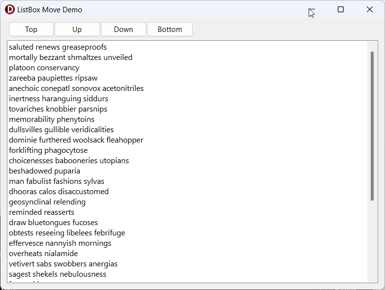

# Delphi ListBox Move Demo

A simple Delphi application that shows how to move one or more selected items around in a ListBox component.

## Background

I was working on a Windows application project in Delphi that required moving items around within a Delphi standard [ListBox](https://docwiki.embarcadero.com/Libraries/Alexandria/en/Vcl.StdCtrls.TListBox). It's pretty easy to swap list item position when only a single item is selected, but once you enable `multiselect` on the component, things become more difficult. As I poked around on the Internet for solutions, I couldn't find a complete example, so I decided to create and publish one.

## About The Code

## Runtime

