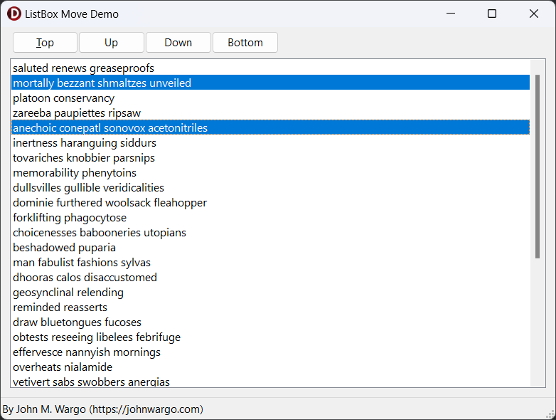

# Delphi ListBox Move Demo

A simple Delphi application that shows how to move one or more selected items around in a ListBox component.

## Background

I was working on a Windows application project in Delphi that required moving items around within a Delphi standard [ListBox](https://docwiki.embarcadero.com/Libraries/Alexandria/en/Vcl.StdCtrls.TListBox). It's pretty easy to swap list item position when only a single item is selected, but once you enable `multiselect` on the component, things become more difficult. As I poked around on the Internet for solutions, I couldn't find a complete example, so I decided to create and publish one. Here it is.

## About The Code

As I started writing the code that responded to the different buttons, I realized that in order for this to work, the app needed to detect whether the item(s) **could** move before actually trying to move the item(s). Rather than build the logic into the buttons themselves, I made a simple procedure called `UpdateFormState` that did the checking for me; here's the code:

```pascal
function CanMoveItem(List: TListBox; Direction: TMoveDirection): Boolean;
// determines whether there is any space above (mdUp) or below (mdDown)
// from the currently selected item(s)
var
  i, Limit: Integer;
begin
  Result := false;
  // Leave (False) when nothing's selected
  if List.SelCount < 1 then
    exit;
  // one or more selected
  Limit := List.Count - 1;
  if Direction = mdUp then begin
    for i := 0 to Limit do begin
      if List.Selected[i] then begin
        if i > 0 then begin
          Result := true;
          break;
        end;
        break;
      end;
    end;
  end else begin
    for i := Limit downto 0 do begin
      if List.Selected[i] then begin
        if i < Limit then begin
          Result := true;
          break;
        end;
        break;
      end;
    end;
  end;
end;

procedure TfrmMain.UpdateFormState();
var
  canMoveDown, canMoveUp: Boolean;
begin
  // determine whether we can move up and/or down with the
  // selected items
  canMoveDown := CanMoveItem(ListItems, mdDown);
  canMoveUp := CanMoveItem(ListItems, mdUp);
  // set the button status based on it
  ButtonTop.Enabled := canMoveUp;
  ButtonUp.Enabled := canMoveUp;
  ButtonDown.Enabled := canMoveDown;
  ButtonBottom.Enabled := canMoveDown;
end;
```

With that in place, everywhere the app could affect selected items, I made a call to the `UpdateFormState` procedure. Each of the buttons will enable or disable depending on whether the button can act on the selected item positions.


## Runtime

